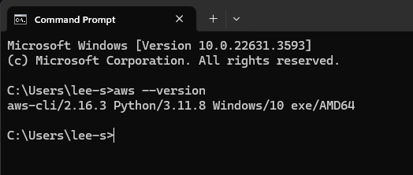

# Week 0 - Billing and Architecture

## Installed AWS CLI on Windows Desktop and GitPod

### Windows Install
```
msiexec.exe /i https://awscli.amazonaws.com/AWSCLIV2.msi
```


### GitPod Install
Updated `.gitpod.yml` with the following code:
```
tasks:
  - name: aws-cli
    env:
      AWS_CLI_AUTO_PROMPT: on-partial
    init: |
      cd /workspace
      curl "https://awscli.amazonaws.com/awscli-exe-linux-x86_64.zip" -o "awscliv2.zip"
      unzip awscliv2.zip
      sudo ./aws/install
      cd $THEIA_WORKSPACE_ROOT
```
## Set AWS Budgets

I also set budgets for both dollar spend and credits spend on AWS


